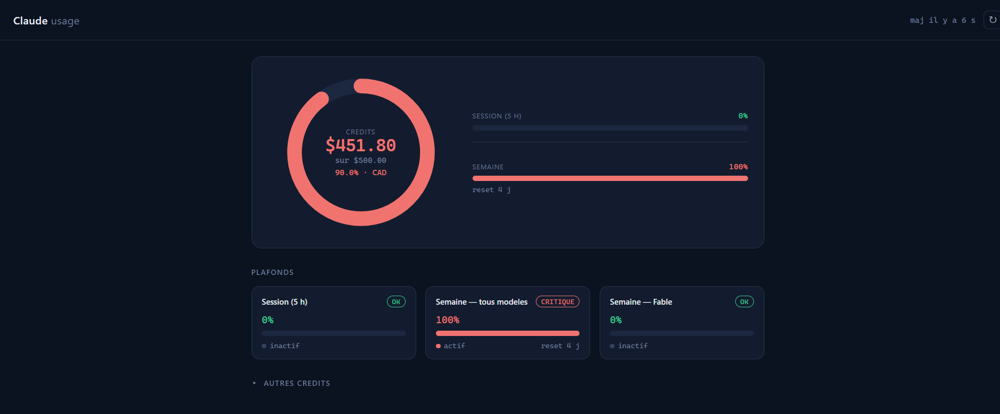

# Claude Usage — extension Chrome



Affiche ta consommation Claude directement dans Chrome :

- **Session (5 h)** — % du plafond glissant sur 5 heures
- **Semaine** — % du plafond hebdomadaire
- **Crédits d'usage** — dépense vs plafond mensuel (ex. `$360.49 / $500.00 CAD`)

Un **badge** sur l'icône de la barre d'outils montre en permanence le pire pourcentage
(vert < 75 %, ambre 75–90 %, rouge ≥ 90 %). Clique l'icône pour le popup.

Le bouton **⤢** du popup ouvre un **dashboard plein écran** : jauge radiale du budget
crédits et cartes détaillées pour chaque plafond (avec sévérité et reset).

## Comment ça marche

L'extension appelle l'API interne de claude.ai :

```
GET https://claude.ai/api/organizations/{orgId}/usage
```

Comme la requête part **depuis ton navigateur**, ton **cookie de session claude.ai
est envoyé automatiquement** (grâce à `host_permissions`). Aucun token, mot de passe
ni cookie à copier-coller : il suffit d'être connecté à claude.ai dans Chrome.

Toutes les **organisations** de ton compte sont détectées via `GET /api/organizations`,
et l'usage est récupéré pour chacune — le dashboard affiche **un bloc par org**. Les
données sont toujours lues **en direct** (le bouton ↻ recharge simplement la page, aucun
cache). Le **badge** (tâche de fond) **et la page ouverte** (popup/dashboard) se
réactualisent automatiquement à un **intervalle configurable**.

## Installation (mode développeur)

1. Ouvre `chrome://extensions`
2. Active **Mode développeur** (coin haut-droit)
3. **Charger l'extension non empaquetée** → sélectionne le dossier `C:\sources\claude_usage`
4. Épingle l'icône « Claude Usage » et connecte-toi à claude.ai si ce n'est pas déjà fait

Pour recharger après modification : bouton ↻ sur la carte de l'extension dans `chrome://extensions`.

## Fichiers

| Fichier | Rôle |
|---|---|
| `manifest.json` | Déclaration MV3, permissions, badge |
| `api.js` | Appel API, cache, normalisation des données |
| `popup.html` / `popup.css` / `popup.js` | Interface du popup |
| `dashboard.html` / `dashboard.css` / `dashboard.js` | Dashboard plein écran (jauge, plafonds) |
| `background.js` | Service worker : rafraîchit le badge toutes les 5 min |
| `icons/` | Icônes générées |

## Langue & réglages

- **Langue** : anglais par défaut, bascule **EN/FR** via le bouton de langue (popup et dashboard).
- **Auto-refresh** : le badge **et** la page ouverte (popup/dashboard) se réactualisent à l'intervalle choisi (1 à 60 min, réglable en bas du dashboard).
- **Dates de reset** : chaque plafond affiche le **compte à rebours** `reset in HH:MM` (tooltip = date absolue `YYYY/MM/DD HH:mm`), qui tourne en direct.
- **Badge** : choisis ce que montre l'icône — **session (défaut)**, pire plafond, semaine ou crédits — via le sélecteur en bas du dashboard.

## Confidentialité

Aucune donnée ne quitte ta machine : l'extension parle uniquement à `claude.ai`
(la même destination que l'appli). Rien n'est envoyé ailleurs, rien n'est journalisé.

## Limite connue

L'endpoint `/usage` n'est **pas documenté** par Anthropic. Il peut changer ou disparaître
à une mise à jour. Si l'affichage casse, vérifie la structure de la réponse dans
`chrome://extensions` → *Inspecter les vues : service worker / popup*.

## Multi-organisation

Si ton compte appartient à plusieurs organisations (plusieurs équipes sur le même
login), l'extension les affiche **toutes** — un bloc par org dans le dashboard, et le
badge montre le pire pourcentage toutes orgs confondues. Un usage « perso » sur un
**autre compte** n'apparaît pas ici : utilise un profil Chrome dédié pour cette session.
